# Fast Lane Detailing Website

Here is a link to the live project.  
(https://jack-19.github.io/milestoneproject-car/)

This website has been created as part of a Code Institute course. (Diploma in software development)
This project is is my milestone one user centric frontend development.
My first project has been created to advertise a vehicle detailing company. (fast lane detailing)
The project has been mainly created using code supplied via bootstrap. This was done to ensure the project is
responsive and laid out clearly. I have altered the layout for many sections using Bootstrap via custom CSS to tweak how things are displayed.  

The main purpose of this project is to show information and allow potential customers to book a detailing service provided by fast lane detailing.  
The project shows previous customer reviews and has a gallery of previous work carried out in order to gain trust from potential customers.

## Main Goal Of project
- Create online presents for company.
- Provide information on company.
- Provide information on services avaliable.
- Show off previous work via image gallery.
- Show previous customers reviews of company.

## Design
I firstly designed my project via wireframes to get an intial idea of how I wanted to lay my project out and which color scheme I was going to use.  
Although my final project has changed slightly from the intital design the majority is the same. The color scheme I choose to use was a black and white theme throughout the project.  
This enabled good contrast between the background and text. I feel it also gives a very professional look and feel to the project.  
My main goal when designing this project was to ensure a good user experience, when carrying out research before starting this project I found other car cleaning companies have
very poor websites. This could be due to poor navigation or just a confusing layout.  
Therefore I wanted a simple layout with one contiuous page to allow the user to simply scroll through all required information without need to do anything other than scroll.
Due to this unique design anyone can easiy navigate the website. This will also support indiviuals who have very little experience using computers or the internet, this ensures the conpmay
will not lose any customers due to not being able to use the navigation effectively.    

## Features
- Social links (used to retain potential customers,
  company updates via social media)
- Online booking
  Online booking form and enquire form
- Easy to navigate
  Simply scroll through the whole page and see all avaliable information
- Responsive design on all devices
  Website avaliable to view on desktop, tablet and mobile devices
- Simple layout
  Layout that encourages the user the scroll 
  Consistant layout to prevent poor user experience
- Online enquiries  
  Submit enquiries from the home section without the need to look for enquiry section.

## Featesures To Add
As part of this project I created a Bootstrap courosel with four images, links and a brief description. I have since decided to leave it out of this project  
due to it not fitting in correctly with the flow of the page. For now I have removed the courosel so it will not be displayed, however I beileve it is a   
a good/ cool feature that I would like to add back in, in the future. I think it could possibly replace the hero image to allow the potential cusomters or users  
of the website to see what services are avalible as soon as they load the page.  
I would also like to add a new section showing prices of avaliable services, this could be easily added by creating a new section and keeping to the same themes. I.E 
background color, font stye and size and layout.
Another feature I would like to add would be the ability to submit the booking / enquiry form to an actual backend. This would create a fully fuctioning online booking system 
for the company.

## Structure  
The structure of my project is slightly different from most others I found when carrying out research.  
It mostly differs from only having one page rather than links to various pages. I found by creating different sections  
and creating links enabled the page to load quicker. This also enables quick navigation throughout the project rather than  
loading pages each time a link is used. I believe this creates a better user experience and makes the project easy to use. Each section is designed to
fill the screen height up to 100% this encourages the user to scroll and see more information which they may have missed. I feel this could possibly encourage a new user
to make a booking or enquire about a service.

## Testing
- Devtools  
I have carried out comprehensive testing of my project before deployment.
I firstly used dev tools to inspect the project, this enabled me to change devices and see how it would be displayed.
It also gave me the ability to move the screen display and check. (make the page wider/thinner taller/shorter)

# Devices
  I then opened the project on as many devices as I could get my hands on just to double check display of the project on different devices.  
  Devices Used:
            - iphone 8
            - iphone 11
            - hp pavilion g series laptop
        - hp laptop
With the project opened on each device I checked:  
  - All images loaded correctly
       All images appeared correctly (not stretched out or squashed up)  
  - All links worked correctly  
       All links navigate to correct section  
       All social links open in new window
  - Load time of page  
       When page refreshed the load time is not too long to avoid a bad user experience
  - Form works correctly (submitting correct data)  
       When form filled out the correct data was submitted  
       The field required warning works correctly on each field    
  - Modal displays correctly  
       Modal displays and allows user interaction
       Submits the correct enquiry data

## Built Width:
- Bootstrap 4 (v4)  
https://getbootstrap.com/  
Used for initial layout before customizing to my exact needs requirements.
- Google Fonts  
https://fonts.google.com/  
Fonts imported to give the exact presentation required
- Font Awesome  
https://fontawesome.com/  
Used to import various icons throughout the project
- Git Hub  
https://github.com/  
Used for creating repository, storing code and deploying project.
- Git Pod  
https://www.gitpod.io/  
Used to create code, edit code and version control.

## Problems Encountered:
I planned on having my service cards section displayed vertically 3 cards wide on desktop view and 1 card on mobile view.
I found difficulty creating a card layout that was responsive how I planned. I overcome this problem via placing the cards code 
inside a Bootstrap col/row code section. Thid created a responsive display for the service card section.  

Another problem I have encountered was when the project was vieved on a mobile device the review section would overflow beyond the section.  
This problem was resolved by using media queries to hide some reviews when on mobile view. i.e Only displaying three reviews on mobile view,  
whereas six will be displayed on desktop view.  

While using a Bootstrap navigation bar code I encountered a problem where when viewed on mobile view the color of the nav icon would clash with the background color. I overrode the Bootstrap CSS in my own CSS to change the color of the icon to white.

# User stories  
#### As a potential new visitor to the website I want to read about the different levels of avaliable services so I can choose a service to book.  
Screenshot shows dedicated section to the different levels of service provided by the company.  

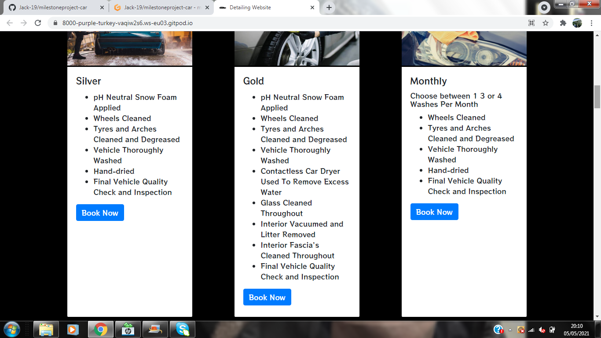
#### As a potential new visitor to the website I want to find the booking section so I can book a service.  
Screenshot shows a dedicated section for the online booking form, with link in navigation bar to find section fast.  

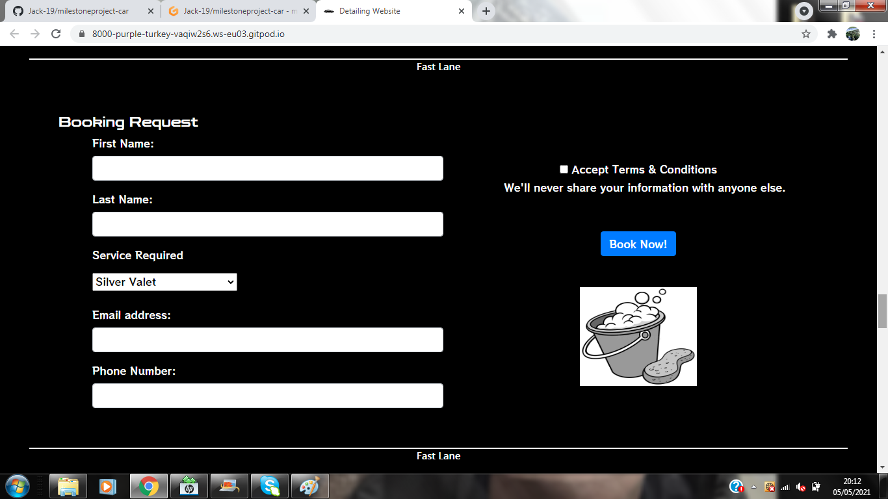
#### As a potential new customer to the website I want to read about previous customers experiences so I can decide to use the company or not.  
Screenshot shows dedicated section to previous customer reviews, with link in navigation bar to find section fast.  

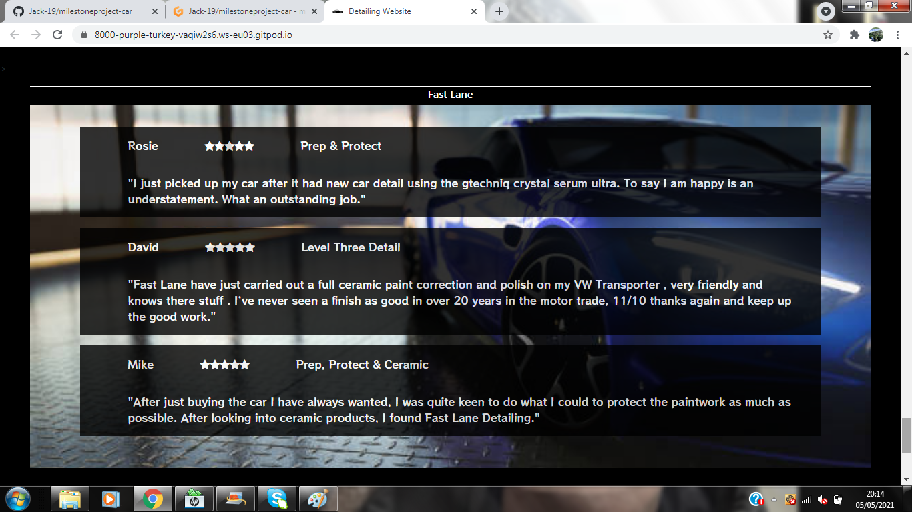
#### As a new user of the website I want to be able to navigate the project easiy and quickly to find information I need so I can contact the company.  
Screenshot shows the navigation bar found at the top of the home page for good user experience.  

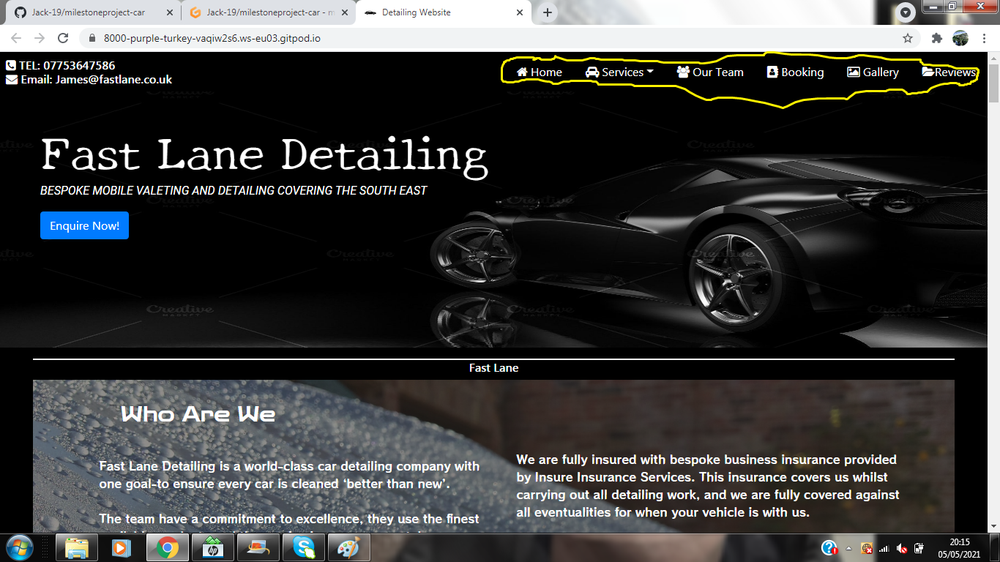
#### As a returning user / customer I want to find contact information quickly so I can arrange a booking fast without scrolling.  
Screenshot shows contact information in the top left hand corner to enable the user to quickly see the contact information.  

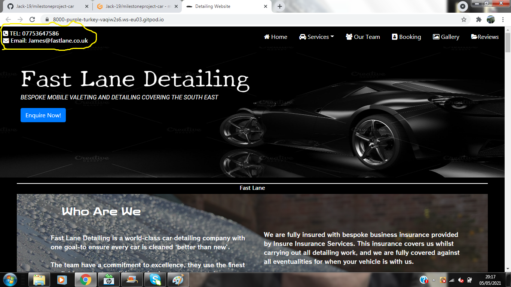
#### As a potential customer I want to see images of previous work carried out so I can be sure to trust this company.  
Screenshot shows a dedicated section to an image gallery of previous work carried out.  

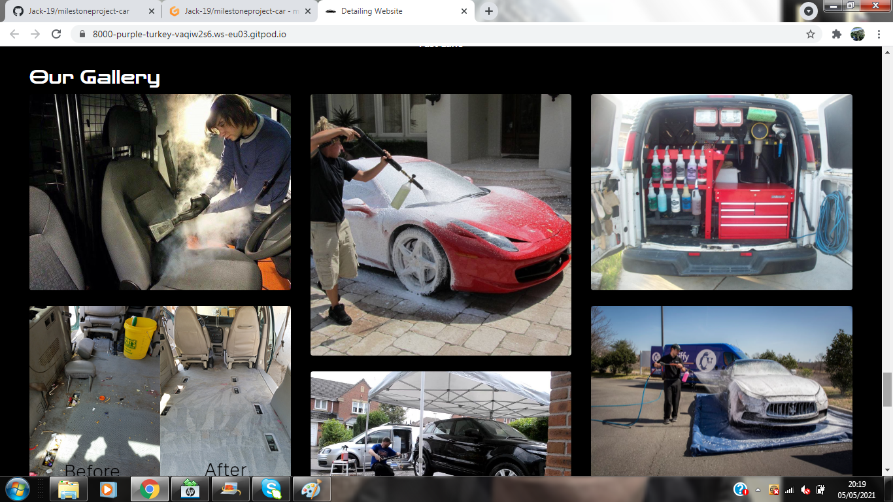
#### As a vehicle owner I want to follow the company on social media so I can keep up to date.  
Screenshot shows social media links to allow the user to quickly find the company on social media.  

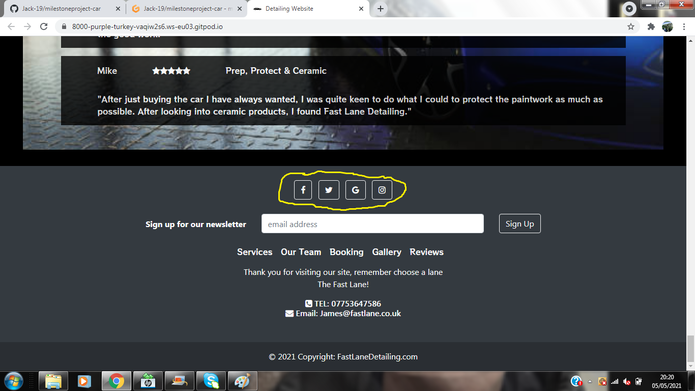
#### As a customer I want to enquire online fast so I can get my booking arranged.  
Screenshot shows a enquire button on the home page as soon as the page loads to enable the user to quickly enquire.  

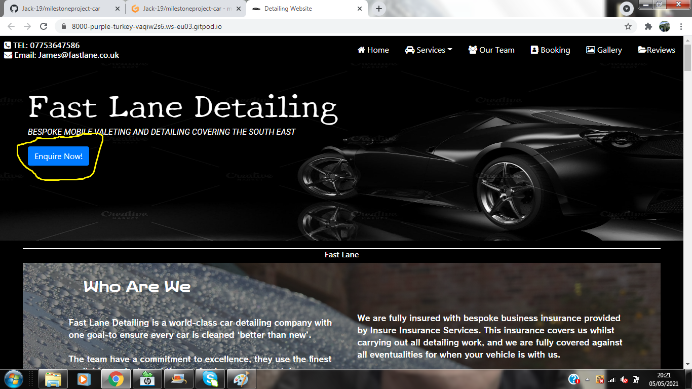
#### As a customer I want to be able to sign up to a news letter so I can keep up to date with the company.  
Screenshot shows a news letter sign up form to enable the user to sign up to a mail listing.  

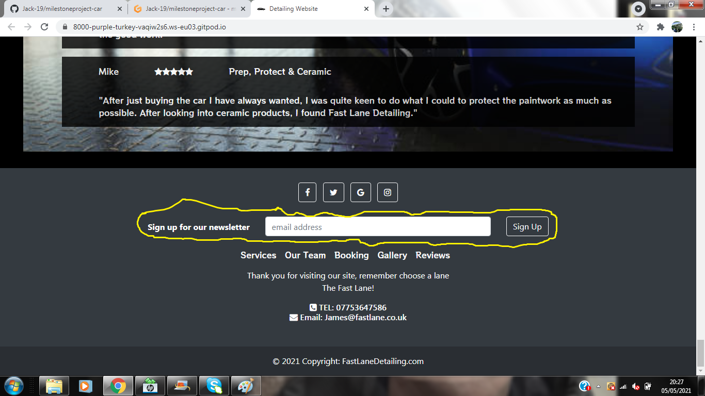
#### As a car owner I want to know what else the company can offer me so I can choose to use them.  
Screenshot shows a dedicated section to the other services offered by the company.  

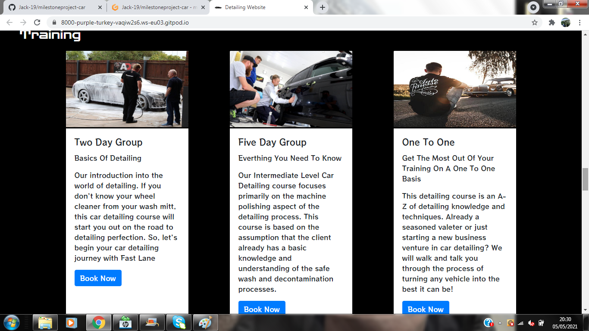

## Home page  
Although the project is one continous page I would describe the top section as the home page, this page contains the navigation bar at the top right
hand side and the contact information on the top left hand size. It also contains my hero image as well as the company name, a brief description of what they do and an enquire button.
It was important to give the user as much information as possible as soon as possible to provide a good user experience. The layout of the home page also
makes the user want to scroll down to see more information or details.  

## About use  
The about us section is a very brief desription of the company and what they have to offer. This section was keep brief to provide a good user experience, rather tan fill the
page with text. This section also displays four images when viewed on a desktop device, two images on a tablet device and no images on mobile view.

## Valeting Packages  
This section shows the different valeting packages the company has to offer. The services are displayed via bootstrap cards in order to present the information clearly. On a desktop device 
the cards are displayed three wide, two wide with one centered underneath on tablet and one stacked on top of another on mobile view.

## Detailing Packages  
This section shows the different detailing packages the company has to offer. The services are displayed via bootstrap cards to show the information clearly.
The cards are displayed three wide on desktop device, two wide with one underneath on tablet and one on top of each other on mobile view.  

## New Vehicle Packages  
This section shows the different packages the company has to offer for new vehicles. The services are displayed via bootstrap cards in order to display the information clearly.
The cards are displayed three wide on desktop view, two wide with one underneath on tablet view and one of top of each other on mobile view.  

## Training  
This section shows the different training packages the company has to offer. This is an extra service provided by the company other than car cleaning.
The infomation on each training course is displayed via bootstrap cards to show information clearly. The cards are displayed three wide on a desktop device
, two wide on a tablet device and one on top of each other on mobile view.  

## Booking request  
This section allows the user to make a booking online. Although the form is set up to transfer information to the code industry dump it could be set up to an
database to professionally make bookings online. The form has a validator to enusre all required fields are filled out and are filled out with the correct information.
 i.e email address contains @.

 ## Our Team  
 This sectin allows the user to see some of the employees at the company. This will create a feel of trust and therefore a good user experience.
 The team members are displayed via bootstrap cards. On a desktop device they are displayed three wide, two wide with one underneath on a tablet and 
 one on top of each other on mobile view.

 ## Our Gallery  
 This section is to allow the user to see images of previous work carried out, again to gain trust and therefore a good user experience.
 The gallery is laid out this way because when carrying out research on other detailing companys they all used a similar display. The images are all displayed responsively
 depending on which device/ screen size you are using.

 ## Reviews  
 This section allows the user to see reviews from previous customers, this creates a feel of trust and therefore a good user experience.
 By having good reviews on the website it will encourage potential customers to make a booking, therefore increasing the number of bookings.

 ## Footer  
 This section using a bootstrap footer in order to create a professional end to the website. Its contains contact information, social media links
 and a email news letter sign up. This sign up is again linked to the code Institute form dump site, however this could easily be set up to a database.

## Contributing:
To contribute to this project follow these steps:
1. Fork this repository.
2. Create a branch.
3. Make changes and commit them.
4. Push to the original branch.
5. Create a pull request.
Alternatively see the documentation on GitHub.

## Deployment
 To deploy this project in Github pages from the repository https://github.com/Jack-19/milestoneproject-car in Github:  
 - Login to Github  
 - Choose correct repository (Jack-19/milestoneproject-car)   
 - Next select settings from the top of the page  
 - Find Github pages  
 - click source drop down menu  
 - Select master branch  
 - Once master branch is selected the project is now deployed  
 - Scroll back to Github pages to find the website link  
     (https://jack-19.github.io/milestoneproject-car/)

## Run project locally
 #### A Githubaccount will be required
 #### Use a supported browser

   1. Add Gitpod browser extention
   2. Restart browser
   3. Log on to Gitpod
   4. Find the project on Git Hub
   5. This will open Gitpod with code to allow you to work locally

   
## Credits:
- Bootstrap
- Code Institute
- Youtube
- Google Fonts
- Font Awesome
- Git Pod
- Git Hub
- Slack

## Contributors:
Jack Smith  
total90-@hotmail.com  
https://github.com/Jack-19

## Contact:
Jack Smith  
total90-@hotmail.com  
https://github.com/Jack-19

## Wireframes:

Final Design:  

Desktop View:    
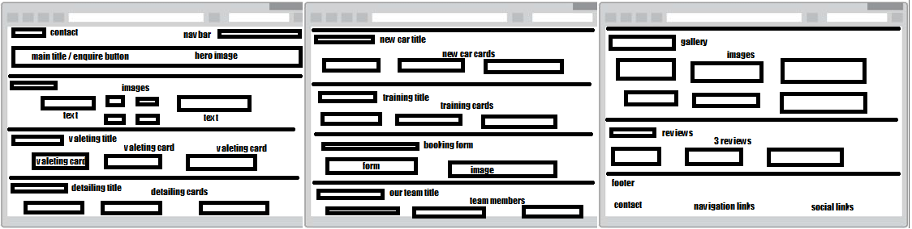  
Tablet View:  
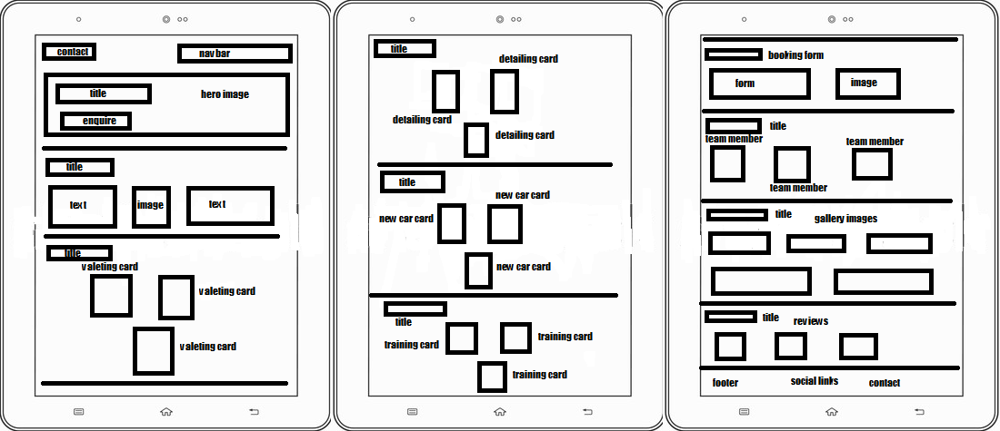  
Mobile View:  
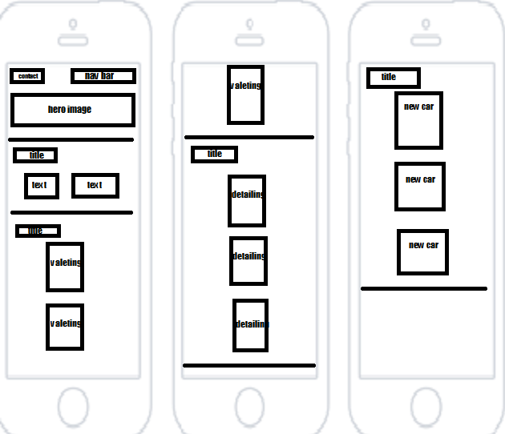  
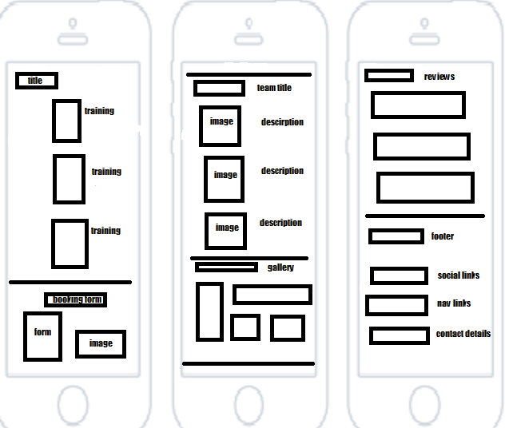