# Fast Lane Detailing Website

Here is a link to the live project.  
(https://jack-19.github.io/milestoneproject-car/)

This website has been created as part of a Code Institute course. (Diploma in software development)
This project is is my milestone one user centric frontend development.
My first project has been created to advertise a vehicle detailing company. (fast lane detailing)
The project has been mainly created using code supplied via bootstrap. This was done to ensure the project is
responsive and laid out clearly. I have altered the layout for many sections using Bootstrap via custom CSS to tweak how things are displayed.  

The main purpose of this project is to show information and allow potential customers to book a detailing service provided by fast lane detailing.  
The project shows previous customer reviews and has a gallery of previous work carried out in order to gain trust from potential customers.

## Design
I firstly designed my project via wireframes to get an intial idea of how I wanted to lay my project out and which color scheme I was going to use.  
Although my final project has changed slightly from the intital design the majority is the same. The color scheme I choose to use was a black and white theme throughout the project.  
This enabled good contrast between the background and text. I feel it also gives a very professional look and feel to the project.   
The first section I designed was the top / nav section:

## Features
- Social links (used to retain potential customers,
  company updates via social media)
- Online booking
- Easy to navigate
- Responsive design on all devices
- Simple layout
- Online enquiries  

## Featesures To Add
As part of this project I created a Bootstrap courosel with four images, links and a brief description. I have since decided to leave it out of this project  
due to it not fitting in correctly with the flow of the page. For now I have commented out the courosel so it will not be displayed, however I beileve it is a   
a good/ cool feature that I would like to add back in, in the future. I think it could possibly replace the hero image to allow the potential cusomters or users  
of the website to see what services are avalible as soon as they load the page.

## Structure  
The structure of my project is slightly different from most others I found when carrying out research.  
It mmostly differs from only having one page rather than links to various pages. I found by creating different sections  
and creating links enabled the page to load quicker. This also enables quick navigation throughout the project rather than  
loading pages each time a link is used. I believe this creates a better user experience and makes the project easy to use.

## Testing
- Devtools
I have carried out comprehensive testing of my project before deployment.
I firstly used dev tools to inspect the project, this enabled me to change devices and see how it would be displayed.
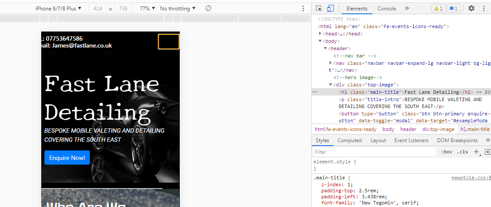
It also gave me the ability to move the screen display and check. (make the page wider/thinner taller/shorter)
- Devices
I then opened the project on as many devices as I could get my hands on just to double check display of the project on different devices.  
Devices Used:
- iphone 8
- iphone 11
- hp pavilion g series laptop
- hp laptop
With the project opened on each device I checked:  
All images loaded correctly  
All links worked correctly  
Load time of page  
Form works correctly (submitting correct data)  
Modal displays correctly  

## Built Width:
- Bootstrap 4 (v4)  
Used for initial layout before customizing to my exact needs requirements.
- Google Fonts  
Fonts imported to give the exact presentation required
- Font Awesome  
Used to import various icons throughout the project
- Git Hub  
Used for creating repository, storing code and deploying project.
- Git Pod  
Used to create code, edit code and version control.

## Problems Encountered:
I planned on having my service cards section displayed vertically 3 cards wide on desktop view and 1 card on mobile view.
I found difficulty creating a card layout that was responsive how I planned. I overcome this problem via placing the cards code 
inside a Bootstrap col/row code section. Thid created a responsive display for the service card section.  

Another problem I have encountered was when the project was vieved on a mobile device the review section would overflow beyond the section.  
This problem was resolved by using media queries to hide some reviews when on mobile view. i.e Only displaying three reviews on mobile view,  
whereas six will be displayed on desktop view.  

While using a Bootstrap navigation bar code I encountered a problem where when viewed on mobile view the color of the nav icon would clash with the background color.  
I overrode the Bootstrap CSS in my own CSS to change the color of the icon to white.

## Contributing:
To contribute to this project follow these steps:
1. Fork this repository.
2. Create a branch.
3. Make changes and commit them.
4. Push to the original branch.
5. Create a pull request.
Alternatively see the documentation on GitHub.

## Credits:
- Bootstrap
- Code Institute
- Youtube
- Google Fonts
- Font Awesome
- Git Pod
- Git Hub
- Slack

## Contributors:
Jack Smith  
total90-@hotmail.com  
https://github.com/Jack-19

## Contact:
Jack Smith  
total90-@hotmail.com  
https://github.com/Jack-19

## Wireframes:

Final Design:
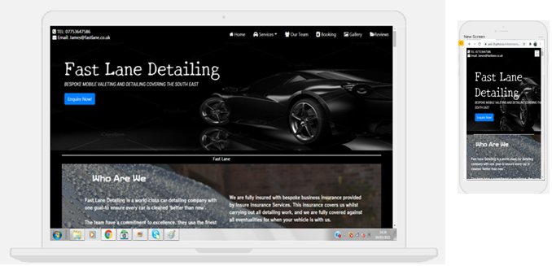
Top Section:
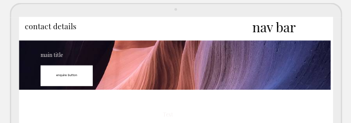
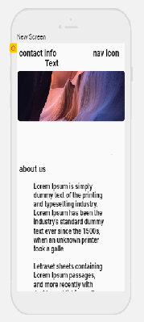

Valeting Section:
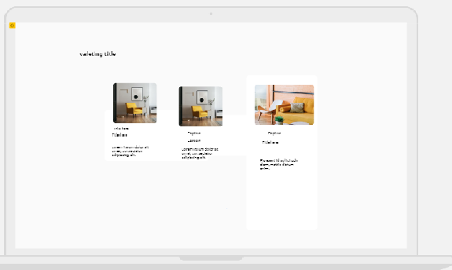

Detailing Section:
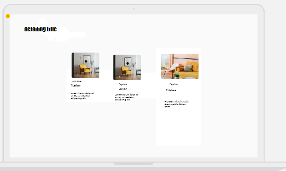
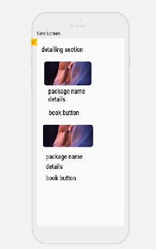

New Vehicle Section:
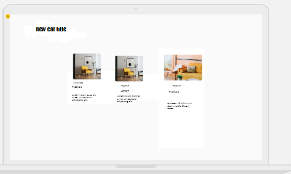

Training Section:

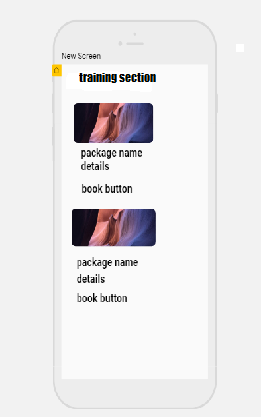

Our Team Section:
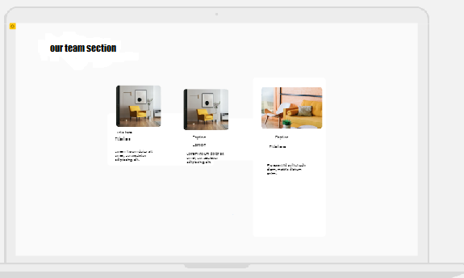

Reviews Section:
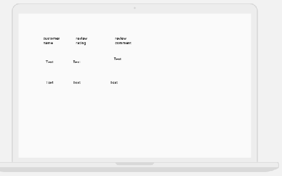
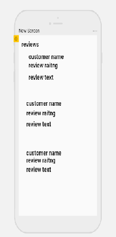

Booking Section:
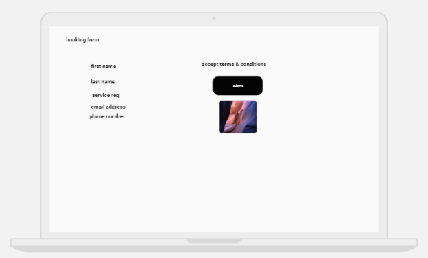
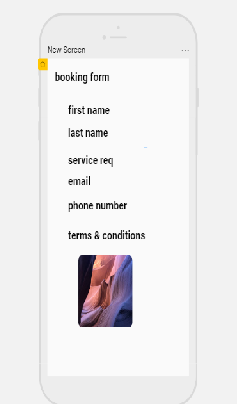

Footer Section:
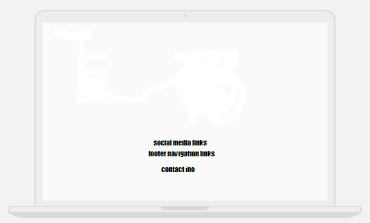
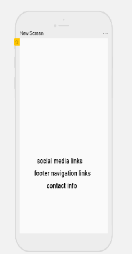